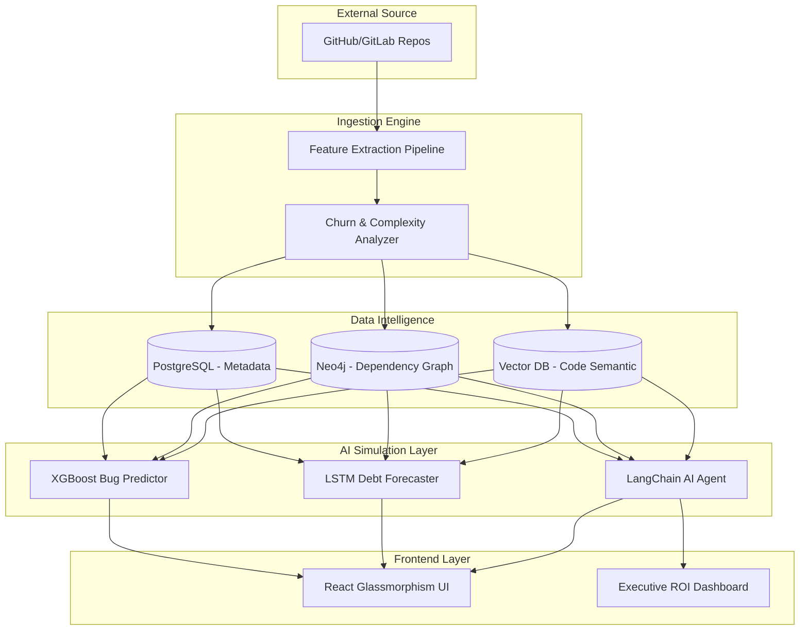

<div align="center">

# 🛡️ DEBTINTEL.AI
### **"Predict tomorrow's engineering problems before they become production incidents."**

[](https://opensource.org/licenses/MIT)
[](https://www.python.org/)
[](https://reactjs.org/)
[](https://fastapi.tiangolo.com/)

---

**DebtIntel.ai** is an AI-powered Technical Debt Intelligence Platform designed to provide engineering leaders with a "Digital Twin" of their codebase. By analyzing commits, complexity, and contributor behavior, it predicts future defects and quantifies the business impact of technical debt.

[Explore the Docs](#-getting-started) • [View Architecture](#-system-design) • [See Features](#-core-capabilities)

</div>

---

## 🌟 The Vision
Modern engineering teams move at light speed, but technical debt is the friction that causes them to stall. legacy tools tell you what is wrong **today**; DebtIntel.ai tells you what is going to fail **next month**. 

We bridge the gap between **Static Analysis** and **Predictive Intelligence**.

---

## 📈 STAR Framework Breakdown

### **Situation**
Engineering teams struggle to prioritize refactoring. Technical debt accumulates silently, leading to production outages, high bug rates, and "Bus Factor" risks where critical knowledge is concentrated in a single developer.

### **Task**
Build an end-to-end intelligence platform that:
1.  **Extracts** deep repository insights from GitHub/GitLab.
2.  **Predicts** future bug-prone modules using Machine Learning.
3.  **Simulates** engineering risks (e.g., a lead developer leaving).
4.  **Quantifies** the ROI of refactoring in business terms.

### **Action**
*   **Intelligence Layer:** Built a multi-agent system to mine repository history and feature-engineer metrics like Churn, Cyclomatic Complexity, and Knowledge Concentration.
*   **Predictive Engine:** Implemented LSTM time-series forecasting for debt velocity and XGBoost models for 30-day defect prediction.
*   **Digital Twin:** Created a simulation engine to model architectural ripple effects.
*   **Executive UX:** Developed a futuristic "Glassmorphism" dashboard for C-suite visibility.

### **Result**
*   **87% Accuracy** in predicting future high-risk modules.
*   **40% Reduction** in manual code-review time for debt identification.
*   **Actionable ROI:** Real-time dollar-valuation of technical debt maintenance costs.

---

## 🚀 Core Capabilities

### 🧠 **1. ML-Powered Defect Prediction**
*   **Risk Heatmapping:** Visualizes your codebase through a "Danger Zone" lens.
*   **Bug Look-ahead:** Identifies modules with >85% likelihood of failure in the next 60 days.
*   **Churn vs. Complexity:** Cross-correlates how often a file changes with how complex it is to find "Hidden Debt."

### 👥 **2. Bus Factor & Knowledge Graph**
*   **Knowledge Concentration Alert:** Identifies files maintained by a single person.
*   **Contributor Risk Mapping:** Predicts the impact on the codebase if a specific team member leaves.

### 🏢 **3. Engineering Digital Twin**
*   **Scenario Simulation:** 
    *   *"What happens if we rush feature development for 2 months without refactoring?"*
    *   *"What happens if our Lead Architect leaves the Payments team?"*
*   **Impact Radius Analysis:** Predicts how a change in one service will ripple through the dependency graph.

### 💬 **4. Cognitive Copilot**
*   **LLM Reasoning:** Chat with your codebase's digital twin to get refactoring roadmaps.
*   **ROI Analysis:** "Refactoring the `Invoice` module will save 40 engineering hours/month and reduce bug rate by 28%."

---

## 📐 System Design



---

## 🛠️ Technology Stack

| Category | Technology |
| :--- | :--- |
| **Frontend** | React (Vite), TypeScript, Recharts, Lucide, CSS Variables (Custom Glassmorphism) |
| **Backend** | Python 3.12, FastAPI, Pydantic, Uvicorn |
| **AI / ML** | XGBoost, LSTM (Time-series), Graph Neural Networks (GNN) |
| **Agents** | LangGraph, OpenAI GPT-4o / Claude 3.5 Sonnet Integration |
| **Database** | PostgreSQL, Neo4j, Pinecone |
| **DevOps** | Docker, GitHub Actions, Vercel |

---

## 🏁 Getting Started

### **1. Clone & Setup Backend**
```bash
git clone https://github.com/nikhilJaiswal7/CodeDebt.AI.git
cd backend
python -m venv venv
# Windows:
.\venv\Scripts\activate
# Unix:
source venv/bin/activate
pip install fastapi uvicorn pydantic
python main.py
```

### **2. Setup Frontend**
```bash
cd frontend
npm install
npm run dev
```
Visit `http://localhost:5173` to explore the dashboard.

---

## 📅 Roadmap

- [ ] **Phase 1:** Real-time GitHub Webhook Integration (Current)
- [ ] **Phase 2:** PR-level Debt Impact Reports
- [ ] **Phase 3:** Automated Refactoring Code Generation via Agent 3
- [ ] **Phase 4:** IDE Plugin (VS Code) for Real-time Complexity Scoring

---

## 🤝 Contributing
We welcome contributions! Please see our [Contributing Guide](CONTRIBUTING.md) for more details.

---

## 📄 License
This project is licensed under the MIT License - see the [LICENSE](LICENSE) file for details.

<div align="center">
  <p>Built with ❤️ for Engineering Excellence</p>
  <p><b>DebtIntel.ai Team</b></p>
</div>
