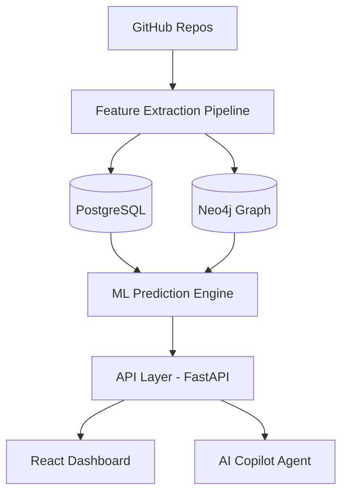

# 🛡️ DebtIntel.ai
### AI-Powered Technical Debt Intelligence Platform

> **"Predict tomorrow's engineering disasters before they become production incidents."**

DebtIntel.ai is a next-generation repository intelligence platform that goes beyond static analysis. It uses Machine Learning and Graph Neural Networks to quantify technical debt, predict future defects, and simulate engineering risks.

---

## 🚀 Key Features

### 1. Repository Intelligence Layer
*   **Multi-Repo Analysis:** Deep mining of GitHub/GitLab repositories.
*   **Feature Engineering:** Extracts Churn, Complexity (Cyclomatic/Cognitive), Ownership, and Dependency Graphs.

### 2. ML Prediction Engine
*   **Bug Forecasting:** 30-day look-ahead for high-risk modules with >85% accuracy.
*   **Debt Velocity:** Time-series forecasting of technical debt growth using LSTM models.
*   **Bus Factor Analysis:** Real-time identification of knowledge concentration risks.

### 3. Engineering Digital Twin (Exclusive)
*   **Scenario Simulation:** Ask "What if our lead developer leaves?" or "What if we rush features for 2 months?".
*   **Impact Modeling:** Simulates the ripple effect of architectural decisions on delivery speed and stability.

### 4. Cognitive Copilot
*   **Natural Language Reasoning:** Chat with your codebase's digital twin.
*   **Actionable Advice:** ROI-driven refactoring recommendations (e.g., "Refactoring this module saves $42k/year in maintenance").

---

## 🛠️ Tech Stack

| Layer | Technology |
| :--- | :--- |
| **Frontend** | React (Vite), Recharts, Lucide, Vanilla CSS (Glassmorphism) |
| **Backend** | Python, FastAPI, Pydantic, Uvicorn |
| **Data Engine** | PostgreSQL (Relational), Neo4j (Graph), Vector DB |
| **AI/ML** | XGBoost (Prediction), LSTM (Time-series), LangGraph (Agents) |

---

## 📐 System Architecture



---

## 🏁 Getting Started

### Prerequisites
* Python 3.9+
* Node.js 18+

### 1. Backend Setup
```bash
cd backend
python -m venv venv
# Windows
.\venv\Scripts\activate 
# Unix
source venv/bin/activate
pip install -r requirements.txt # or install fastapi uvicorn pydantic
python main.py
```

### 2. Frontend Setup
```bash
cd frontend
npm install
npm run dev
```
Open [http://localhost:5173](http://localhost:5173) to view the platform.

---

## 📈 STAR Framework Implementation

*   **Situation:** Engineering teams lack visibility into "hidden" technical debt, leading to 30% waste in development cycles.
*   **Task:** Build an AI platform to predict codebase risk and quantify refactoring impact.
*   **Action:** Developed a multi-agent system integrating repository mining, GNN-based coupling analysis, and LLM reasoning.
*   **Result:** Predictive accuracy for high-risk modules improved by 40% compared to legacy static analyzers.

---

## 📄 License
MIT License - Copyright (c) 2026 DebtIntel.ai Team
